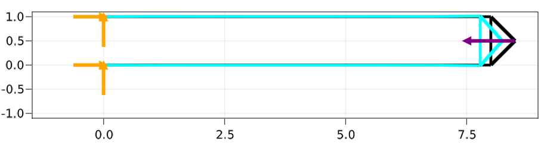
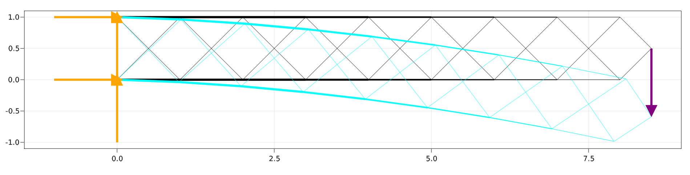
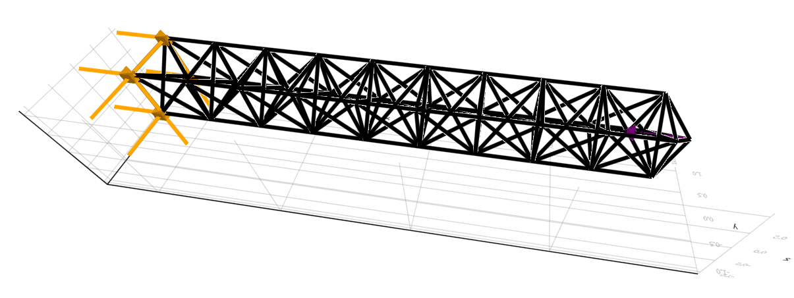
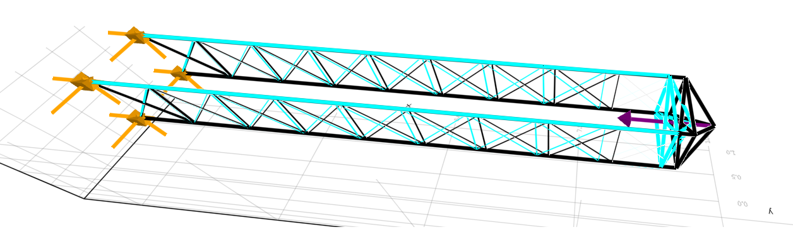
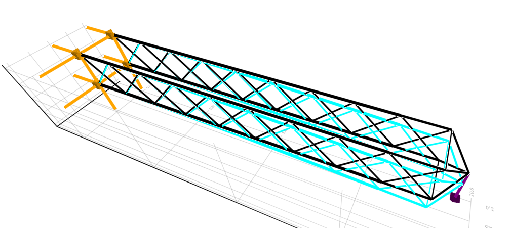

# TrussTopOpt.jl

[](https://www.repostatus.org/#wip)
[](https://travis-ci.org/yijiangh/TrussTopOpt.jl)
[](https://codecov.io/gh/yijiangh/TrussTopOpt.jl)

Truss topology optimization experiments using [TopOpt.jl](https://github.com/mohamed82008/TopOpt.jl) and [JuAFEM.jl](https://github.com/KristofferC/JuAFEM.jl).

<!-- ## Documentation -->
<!-- [](https://yijiangh.github.io/TopOpt.jl/dev) -->
<!-- [Dev doc](https://docs.google.com/document/d/1SbHCct2B0aTH4drSAJX5HGYlxkyCiAznsFe5GMzzCyw/edit?usp=sharing) -->

## Installation

In Julia v1.0+ you can install packages from the Pkg REPL (press `]` in the Julia
REPL to enter `pkg>` mode):

```
pkg> add https://github.com/yijiangh/JuAFEM.jl.git
pkg> add https://github.com/yijiangh/Tensors.jl.git
pkg> add https://github.com/mohamed82008/VTKDataTypes.jl#master
pkg> add https://github.com/mohamed82008/KissThreading.jl#master
pkg> add https://github.com/mohamed82008/TopOpt.jl#master
pkg> add https://github.com/yijiangh/TrussTopOpt.jl#master
```

which will track the `master` branch of the package.

To load the package, use

```julia
using TrussTopOpt
```

## Gallery

Code for reproducing these results can be found in the scripts in the `test` folder.

### `tim_2d`

- Ground mesh:
    

- Topology optimized result under horizontal load (buckling):
    - **without buckling constraint** (shape in cyan is the exaggerated deformed shape)
        

- Topology optimized result under vertical load (beam):
    

### `tim_3d`

- Ground mesh:
    

- Topology optimized result under horizontal load (buckling):
    - **without buckling constraint** (shape in cyan is the exaggerated deformed shape)
        

- Topology optimized result under vertical load (beam):
    

